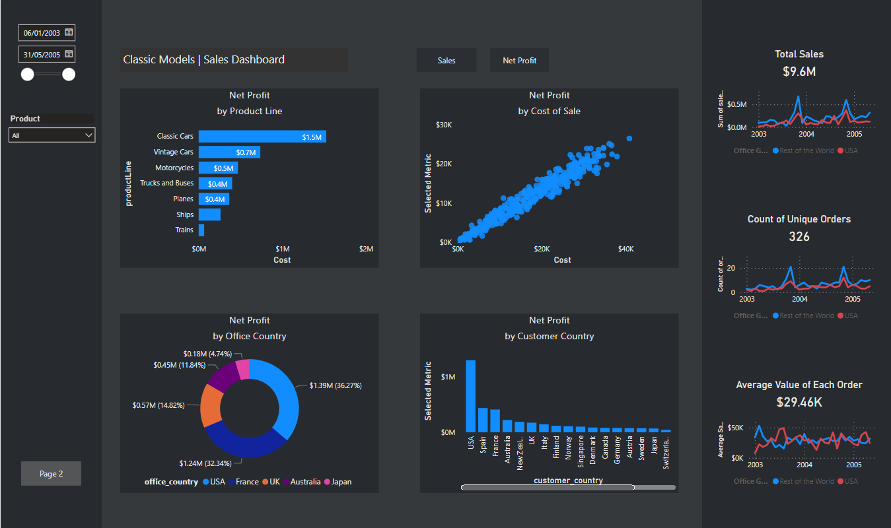

# Sales-Dashboard

## About the project
- This dataset contains information about a fictional company which include such as customer information, orders, order details, payments and offices.  The company wholesales classic model cars and has seven branch offices worldwide.
  
- The aim is to provide analysis where the company can improve business for example, by identifying which products are most profitable and which ones are not.
  
- The link to the data: https://www.mysqltutorial.org/mysql-sample-database.aspx

- Developed a PowerBI dashboard to perform analysis, producing visualisations to draw insights.

- Tools used: PowerBI, MySQL

.png)
